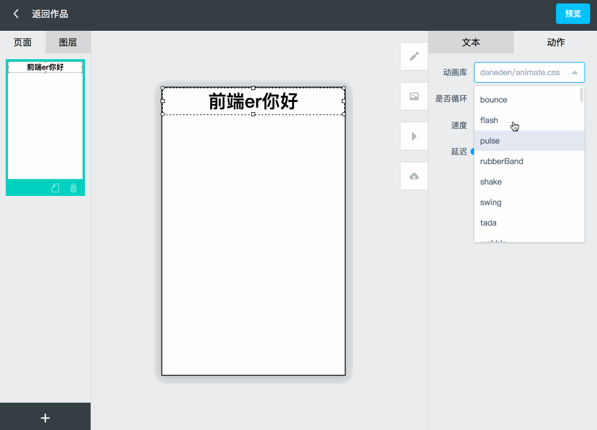

## h5在线编辑平台

### 技术架构
> 前端：vue2.0 + vue-router + vuex + axios + Element ui

> 后端：nodejs + express + mongoose

### <a href="http://h5.limesoftware.cn/">在线演示传送门</a>

### 演示效果

### 目录结构

<!--### 应用截图

 

-->
### 注意！！！
运行前需要先启动mongodb数据库，请确保本地已安装数据库

### 运行方法
> npm install  // 安装依赖

> npm run webapp // 启动前端工程

> npm run local //  启动后端工程

## License

[996 License](https://github.com/zhengguorong/h5maker/blob/master/LICENSE)
